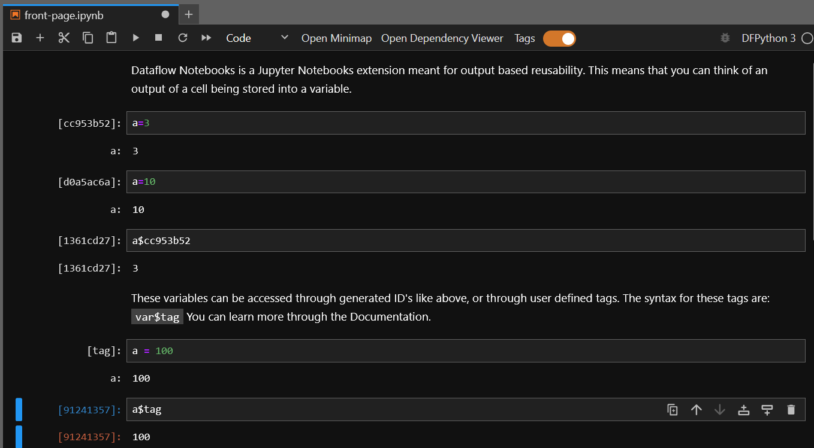

.. rammdocs documentation master file, created by
   sphinx-quickstart on Fri Jul 26 10:12:15 2024.
   You can adapt this file completely to your liking, but it should at least
   contain the root `toctree` directive.

Welcome to rammdocs's documentation!
====================================

Quickstart
============

Installation

.. code-block::

   pip install dfnotebook

From Source (Using Anaconda)

.. code-block::

   

   conda create --name dfnotebook -y jupyterlab
   conda activate dfnotebook

   git clone https://github.com/dataflownb/dfnotebook-extension.git
   git clone https://github.com/dataflownb/dfkernel.git

   cd dfnotebook-extension

   pip install -e .

   cd ../dfkernel

   pip install -e .
   
   #At this point you can use the dfnotebooks
   jupyter lab

   #For developing, create the symlink
   jlpm develop

   #For building
   jlpm build

Contents
^^^^^^^^
.. highlight:: none
.. toctree::

   notebooks/tutorial.ipynb
   notebooks/dependencies.ipynb
   notebooks/tag_info.ipynb
   notebooks/we-do-better.ipynb

Examples
^^^^^^^^
.. highlight:: none
.. toctree::

   notebooks/1.ipynb
   notebooks/digits-example.ipynb

Indices and tables
==================

* :ref:`genindex`
* :ref:`modindex`
* :ref:`search`

